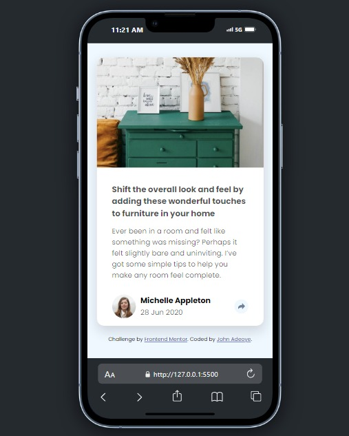
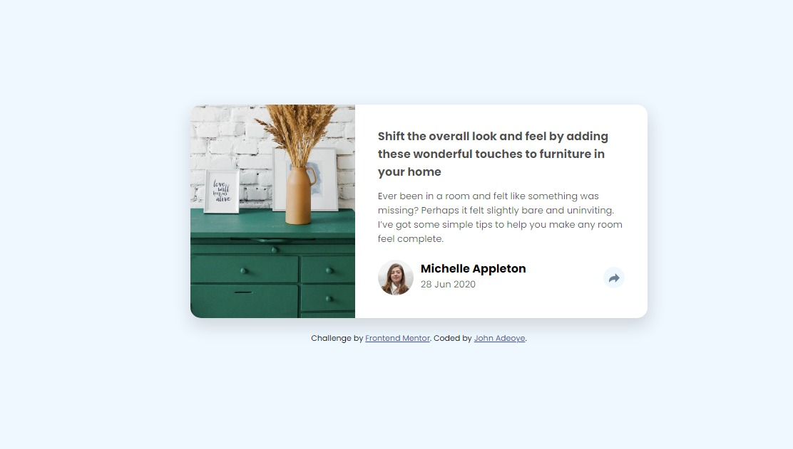
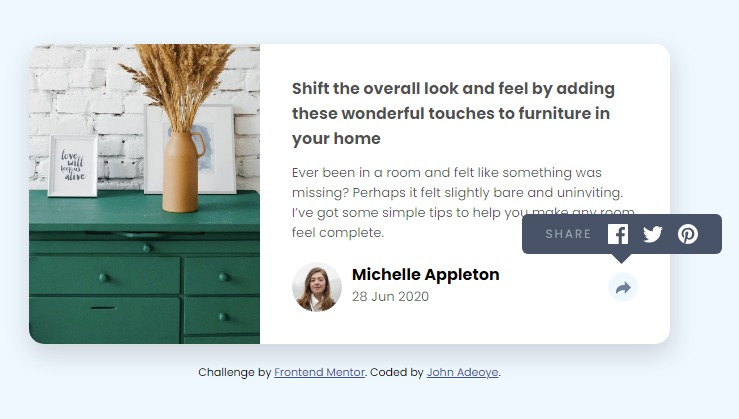
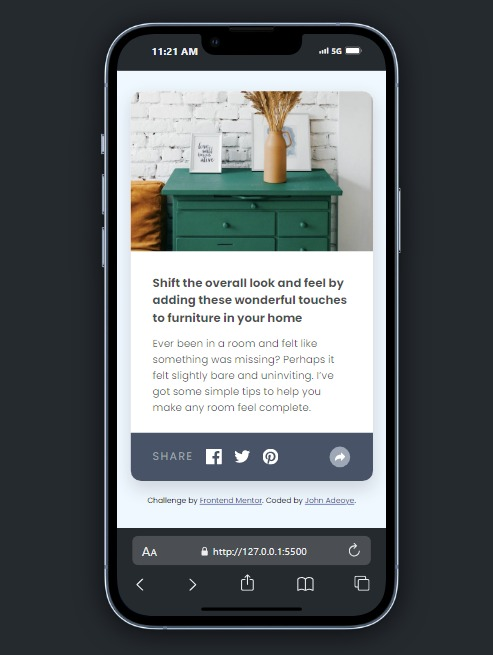

# Frontend Mentor - Article preview component solution

This is a solution to the [Article preview component challenge on Frontend Mentor](https://www.frontendmentor.io/challenges/article-preview-component-dYBN_pYFT). Frontend Mentor challenges help you improve your coding skills by building realistic projects. 

## Overview

### The challenge

Users should be able to:

- View the optimal layout for the component depending on their device's screen size
- See the social media share links when they click the share icon

### Screenshot

### Links

- Solution URL: [Add solution URL here](https://github.com/Jstickz/article-preview-component-master.git)
- Live Site URL: [Add live site URL here](https://your-live-site-url.com)

## My process

### Built with

- Semantic HTML5 markup
- CSS custom properties
- Flexbox
- Mobile-first workflow
- JavaScript

### What I learned

I learned how to properly us the "addEventListener()" method to make an action after listening for a event

### Continued development

I would like to practice more to understand and master how to use method properly in JavaScript

### Useful resources

https://www.w3schools.com

## Author

- Frontend Mentor - [@Jstickz](https://www.frontendmentor.io/profile/Jstickz)
